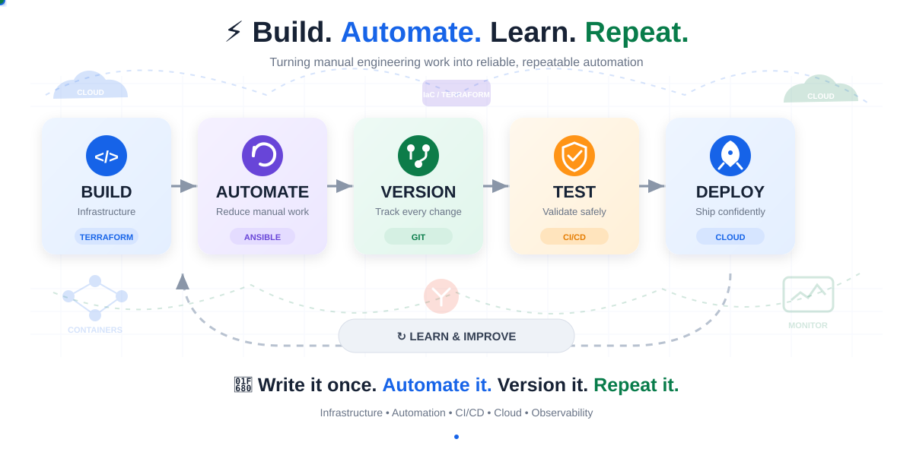
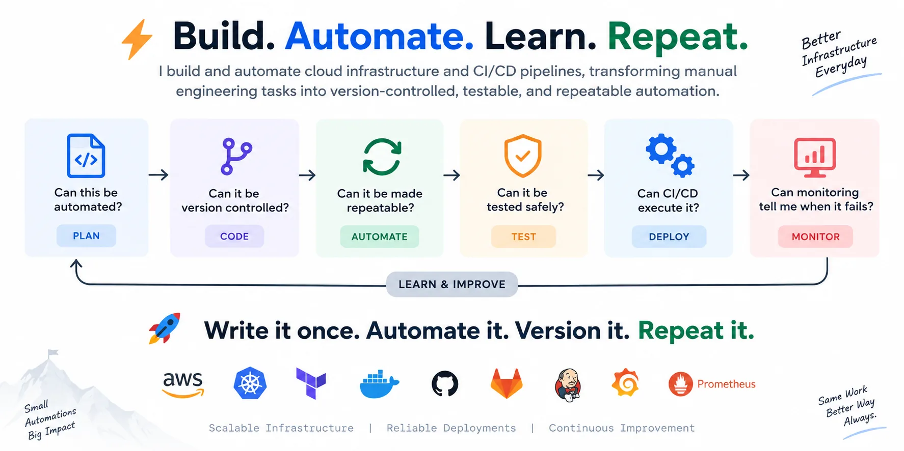
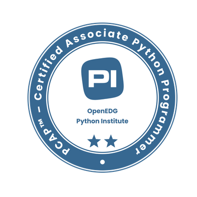
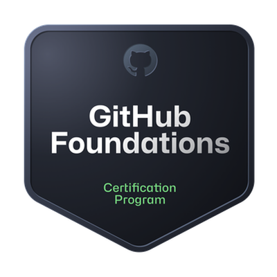
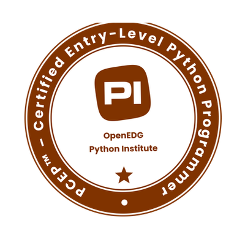
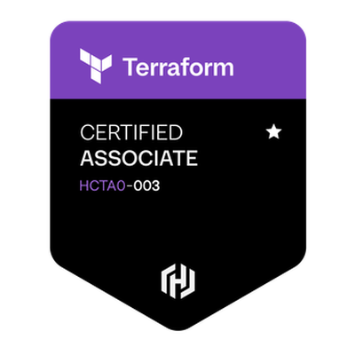

  

## About Me
I'm a Cloud & DevOps Engineer with 4 years of experience in designing, automating, and operating cloud infrastructure. Specialised 
in implementing monitoring and observability solutions using Prometheus, Grafana, and the ELK Stack to sustain 99.9% production uptime. Proficient in building CI/CD pipelines, automating infrastructure with Terraform, and orchestrating containerised workloads with Kubernetes. A strong problem solver with a willingness to learn and improve system reliability.

<!-- 

  

  

 -->

## 🧭 DevOps Toolkit

  
  
  
  
  
  
  
  
  
  
  
  
  
  

## 🚀 Projects

| Name | Architecture | Stack | Security | CI/CD | IaC | Cloud | Status |
|---|---|---|---|---|---|---|---| 
| [**WebBlog**](https://github.com/mukul-329/WebBlog) | 3-Tier | React · Node.js · MongoDB | SonarQube, Trivy  | Github Actions | Not Implemented | AWS EC2 | 🟡 In Progress |
| [**OneApps**](https://github.com/mukul-329/OneApps) | 3-Tier | React · Node.js · MySQL | SonarQube, Trivy | Jenkins | Not Implemented | AWS EC2 | 🟡 In Progress |
| [**Terraform Modules**]() | 3-Tier | Java · Spring · PostgreSQL | Trivy | GitLab | Terraform | Azure | 🟡 In Progress |

## 🗺️ DevOps Roadmap

  <i>
    A practical learning journey from fundamentals to real-world DevOps —
    covering concepts, hands-on practice, projects, documentation,
    and a structured 90-day learning path.
  </i>

  <b>Learn → Practice → Build → Document → Improve</b>

  

  

  
   
  
  
  
   
      
       
       
   
   

## 🎓 Certifications

  
  
  
  
  
  
  
  

## 📊 GitHub Stats:
 

## 🌐 Connect With Me

